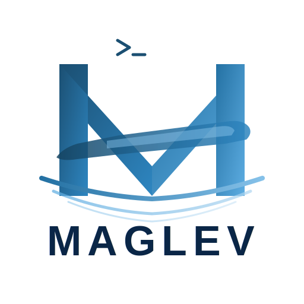

<p align="center">
  
</p>

<h1 align="center">maglev</h1>

<p align="center">Run AI coding shells locally, then control them from your browser or phone.</p>

## Start Here

Pick the setup that matches where your shell will run:

| Use case | Best fit | Open the UI from |
|----------|----------|------------------|
| Local laptop or devbox | Hub and shell on the same machine | `http://localhost:3006` |
| SSH workstation | Hub on the remote machine, browser through an SSH tunnel | `http://localhost:3006` on your laptop |
| Slurm/HPC node | Hub inside the allocation, broker on a reachable login/VNC node | The URL printed by `maglev hub start --remote` |

## Install

Fast path: install the latest prebuilt release for your machine.

```bash
curl -fsSL https://github.com/bmarimuthu-nv/Maglev/releases/latest/download/install.sh | sh
maglev --version
```

The release installer detects macOS Intel/Apple Silicon, Linux x64/arm64, Linux glibc/musl, and Windows x64 from Git Bash/MSYS. It installs `maglev` to `$HOME/.local/bin` by default.

Common variants:

```bash
# Install somewhere else
curl -fsSL https://github.com/bmarimuthu-nv/Maglev/releases/latest/download/install.sh | MAGLEV_INSTALL_DIR="$HOME/bin" sh

# Install a specific release tag
curl -fsSL https://github.com/bmarimuthu-nv/Maglev/releases/latest/download/install.sh | MAGLEV_VERSION="v0.16.2" sh
```

If `maglev` is not found after install:

```bash
export PATH="$HOME/.local/bin:$PATH"
```

## Build From Source

Use this path when working from a checkout, testing unreleased changes, or using a platform without a release artifact.

Prerequisites:

- `git`
- `bun`
- Optional but recommended: `rg` and `difft`

```bash
git clone https://github.com/bmarimuthu-nv/Maglev.git maglev
cd maglev
./install.sh
maglev --version
```

`./install.sh` builds the standalone binary from source and installs `maglev` to `$HOME/.local/bin`.

Common variants:

```bash
# Install somewhere else
MAGLEV_INSTALL_DIR="$HOME/bin" ./install.sh

# Force dependency reinstall before building
FORCE=1 ./install.sh

# Build only, without installing
bun install
bun run build:standalone
```

## Local Setup

Use this when your browser and coding shell are on the same machine.

```bash
maglev hub start --name local
maglev shell
```

Open:

```text
http://localhost:3006
```

Optional: start the runner if you want the web UI to create new shells later.

```bash
maglev runner start
```

## SSH Setup

Use this when Maglev runs on a remote workstation but you browse from your laptop.

On the remote workstation:

```bash
maglev hub start --name devbox --host 127.0.0.1
maglev shell
```

On your laptop:

```bash
ssh -L 3006:127.0.0.1:3006 user@devbox
```

Then open this on your laptop:

```text
http://localhost:3006
```

Optional: keep remote spawning available from the web UI:

```bash
maglev runner start
```

## Slurm / HPC Setup

Use this when shells run on ephemeral compute nodes that your browser cannot reach directly.

On a stable login, VNC, or jump node:

```bash
# Terminal 1: keep the broker running
maglev server

# Terminal 2: authenticate browser access once
maglev auth github login
```

Inside the Slurm allocation:

```bash
srun --pty bash
maglev hub start --name "slurm-${SLURM_JOB_ID:-manual}" --remote
maglev shell
```

Open the URL printed by `maglev hub start --remote`.

If the browser cannot reach the broker hostname, start the broker with the public URL you actually use:

```bash
maglev server --public-url https://your-reachable-broker.example
```

If the login node and compute node do not share `~/.maglev`, pass broker details explicitly:

```bash
# On the login/VNC node
cat ~/.maglev/broker-url
cat ~/.maglev/broker-key

# Inside the Slurm allocation
maglev hub start --remote \
  --broker-url http://login-node:3010 \
  --broker-token "<broker-key-from-login-node>"
```

## Daily Commands

```bash
maglev hub status
maglev hub logs --follow
maglev hub stop

maglev runner status
maglev runner logs
maglev runner stop

maglev server hubs
```

## Services

For long-running Linux user services:

```bash
maglev hub service install
maglev server service install
```

For named hubs:

```bash
maglev hub start --name devbox-a --remote
maglev hub status --name devbox-a
maglev hub logs --name devbox-a --follow
```

## Mental Model

- `maglev hub` stores session state and serves the web UI.
- `maglev shell` starts a shell session and registers it with the hub.
- `maglev runner` lets the web UI spawn new shells on that machine.
- `maglev server` is the optional broker for machines your browser cannot reach directly.

## More Docs

- [Quick Start](docs/guide/quick-start.md)
- [Installation](docs/guide/installation.md)
- [How it Works](docs/guide/how-it-works.md)
- [App](docs/guide/pwa.md)
- [Why Maglev](docs/guide/why-maglev.md)
- [FAQ](docs/guide/faq.md)
